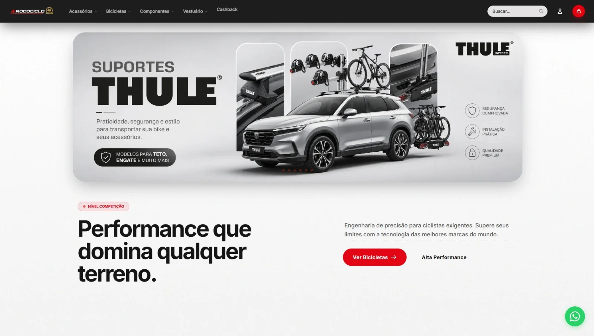

# Artur Silveira — Portfolio

A fast, responsive one-page portfolio for Artur Silveira de Albuquerque, Product & Visual Designer in Porto Alegre, Brazil. The site is built with semantic HTML, modern CSS and small, dependency-free JavaScript so it can be deployed directly to Netlify.

## Project structure

```text
.
├── index.html                         Page content, metadata and structured data
├── style.css                          Visual system, responsive layouts and motion
├── script.js                          Progressive enhancement and interactions
├── netlify.toml                       Static publishing, security and cache headers
├── README.md                          Maintenance and publishing guide
└── assets/
    ├── images/                        Project and visual-work WebP files
    ├── videos/                        Optimized MP4 motion work
    └── resume/                        Downloadable résumé PDF
```

The current media areas are CSS-rendered placeholders. They display the expected path without requesting a missing file, so there are no media-related 404s during page load.

## Run locally

No installation or build step is required. Do not open `index.html` directly if you want to test the site under production-like conditions; run a small static server from the project root instead.

With Python:

```bash
python -m http.server 8080
```

Then open `http://localhost:8080/`.

Other static file servers work as well. The site has no npm dependencies and no generated output folder.

## Deploy on Netlify

1. Import the repository into Netlify.
2. Leave the build command empty.
3. Use the repository root (`.`) as the publish directory.
4. Deploy.

The included `netlify.toml` already supplies the publish directory, security headers and asset caching rules. Before the public launch, add the final production URL to the canonical link placeholder in `index.html` and add the same URL to Open Graph metadata if desired.

## Replace the project screenshots

Export and copy the final screenshots to these exact paths:

```text
assets/images/rodociclo-before.webp
assets/images/rodociclo-after.webp
assets/images/rodociclo-mobile.webp
assets/images/biketech-before.webp
assets/images/biketech-after.webp
assets/images/biketech-mobile.webp
```

The first version deliberately does not include `` elements for missing files. When an image is ready, replace the matching `.placeholder-canvas`, `.comparison-pane` or `.split-canvas` placeholder in `index.html` with a `<picture>` element. Example:

```html
<picture>
  <source media="(max-width: 760px)" srcset="assets/images/rodociclo-mobile.webp">
  
</picture>
```

Always keep explicit `width` and `height` attributes to prevent layout shifts. Write alt text that describes what is visible and why the screenshot matters; avoid repeating the project name without adding information. For a before-and-after pair, distinguish the earlier experience from the implemented change in each alt description.

### Recommended screenshot dimensions

- Desktop project screenshots: 1600 × 1000 px or 1920 × 1200 px, 8:5 ratio.
- Mobile screenshots: 720 × 1440 px or 900 × 1800 px, 1:2 ratio.
- Before-and-after images: use identical dimensions and crop positions.
- Visual gallery images: at least 1200 px on the longest edge; preserve the composition’s natural ratio.

Export as WebP in sRGB. A quality setting around 72–82 is a good starting range. Aim for 120–280 KB for desktop screenshots and under 160 KB for mobile or gallery images. Inspect typography and fine interface details after compression; use the smallest file that remains visually clean.

## Replace the visual-work images

Add the three files below, then replace their matching `.gallery-placeholder` elements with lazy-loaded `` or `<picture>` markup:

```text
assets/images/visual-work-01.webp
assets/images/visual-work-02.webp
assets/images/visual-work-03.webp
```

Keep the existing `<figure>` and `<figcaption>` structure. Update each caption and alt description so they explain the work accurately.

## Replace the videos

Add the final videos at:

```text
assets/videos/motion-work-01.mp4
assets/videos/motion-work-02.mp4
```

Replace the matching gallery placeholder with a native `<video controls preload="none" playsinline>` element. Do not add `autoplay`. Add a compressed WebP poster image so the browser does not need to load the video to paint the gallery.

Recommended encoding:

- MP4 container with H.264 video and AAC audio.
- 1080p or 720p depending on source quality.
- 24 or 30 fps; avoid exporting a higher frame rate than the source.
- CRF 24–28 or an equivalent visually inspected quality target.
- AAC around 96–128 kbps when audio is necessary.
- Enable “fast start” / move the MP4 `moov` atom to the beginning.
- Keep portfolio clips concise and ideally below 5–8 MB each.

## Update the résumé

A clean one-page starter résumé is included at:

```text
assets/resume/Artur_Silveira_Resume_Automattic.pdf
```

It uses only the facts supplied for this project and makes every download link functional in the first version. Artur should review and replace it with the final application résumé before launch. All résumé links already point to that path and use the browser’s download behavior. Keep the filename unchanged or update every résumé link in `index.html`. Compress embedded images and verify that the PDF remains selectable, accessible and comfortably below 2 MB.

## Reduced-motion support

The page respects the operating system’s `prefers-reduced-motion` setting. When reduction is requested:

- smooth scrolling is disabled;
- decorative orbits, floating objects and pointer ambience are removed;
- staged reveal transitions show their final state immediately;
- counters display their final values without animation;
- sticky process positioning is simplified.

All content remains visible without JavaScript. JavaScript adds the mobile menu behavior, scroll reveals, one-time metric animation, timeline drawing, hero ambience and the generated footer year.

## Update project and profile text

All visitor-facing copy is in `index.html` and can be edited directly. Project case studies are inside `<details class="case-study">` elements. Keep each section concise and evidence-based. If the commercial result changes, update both the visible outcome panel and the Rodociclo case-study outcome so the wording stays consistent.

Do not add proficiency percentages, unverified growth claims, invented research methods or social links that Artur does not use. Keep “Social Media Manager” limited to Rodociclo Bikeshop and Bike Tech Moinhos unless Artur’s responsibilities change.

## Content requiring Artur’s confirmation

Before the final public launch, Artur should confirm:

- the final résumé PDF and whether the Automattic-specific filename should remain public;
- the precise Rodociclo results wording and the current R$30,000–R$50,000 range;
- the concise starter case-study narratives, especially research, feedback, rollout and technical details;
- role titles and employment dates for all three experience entries;
- education names, providers and completion dates;
- English level, email address, location and remote-availability statement;
- final screenshots, visual work, motion work, captions and descriptive alt text;
- the production domain for canonical and share metadata.

HTML comments are placed inside both case studies as editorial reminders. They do not appear to visitors.

## Performance and accessibility notes

- No frameworks, package manager, remote fonts, third-party scripts or animation libraries.
- System font stack avoids font downloads and layout shifts.
- Decorative movement uses transforms and opacity and pauses when the hero is off screen.
- Section reveals, counters and timeline drawing use `IntersectionObserver` and run once.
- Touch layouts remove pointer-only effects and simplify decorative layers.
- Native `<details>` controls provide keyboard-accessible case studies.
- The navigation, menu button, focus indicators, landmarks, heading hierarchy and skip link are accessible by keyboard.
- Media is only loaded after real files are added, and should use lazy loading except for any image that becomes the page’s largest contentful paint element.
